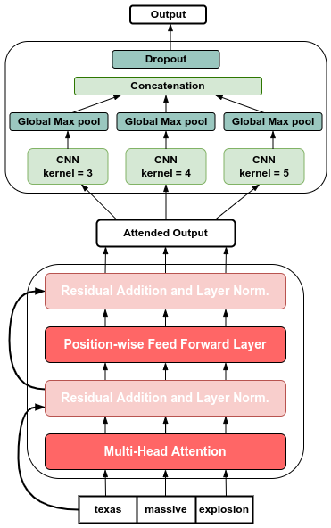

# Leveraging Transformer Self Attention Encoder for Crisis Event Detection in Short Texts

This is the python implementation of the models presented in "Leveraging Transformer Self Attention Encoder for Crisis Event Detection in Short Texts" (ECIR 2022) (Pantelis Kyriakidis, Despoina Chatzakou, Theodora TsikrikaStefanos Vrochidis, Ioannis Kompatsiaris). 

The paper introduces novel architectures that surpass the performance of the previous SOTA (Multichannel Convolutional Neural Network, MCNN) on CrisisLexT26.

We leverage Transformer Self Attention Encoders that are able to extract features from the input embeddings unaffected from the word n-grams (CNNs) or the distance between separate words (RNNs). By paying attention to the input, each word distributes its attention over all the other words. Residually adding the attention context to the input, reduces the noise and enhances important contextualized features. 

> Read more about Transformers and their Self Attention Encoder in the original paper ["Attention is all you need"](https://arxiv.org/abs/1706.03762) and this educational [blog post](https://jalammar.github.io/illustrated-transformer/).

The following figure illustrates the architecture of the best performing model, AD-MCNN:

  

Important distinctions from the transformer architecture:
* Positional encoding is observed that reduces performance and therefore is not being used.
* Multi-head attention performs better when input transformations are performed non-linearly.

### Cite as:
Kyriakidis, P., Chatzakou, D., Tsikrika, T., Vrochidis, S., Kompatsiaris, I. (2022). Leveraging Transformer Self Attention Encoder for Crisis Event Detection in Short Texts. In: , et al. Advances in Information Retrieval. ECIR 2022. Lecture Notes in Computer Science, vol 13186. Springer, Cham. https://doi.org/10.1007/978-3-030-99739-7_19

### Acknowledgements
This research has received funding from the European Union’s H2020 researchand innovation programme as part of the INFINITY (GA No 883293) and AIDA(GA No 883596) projects.
